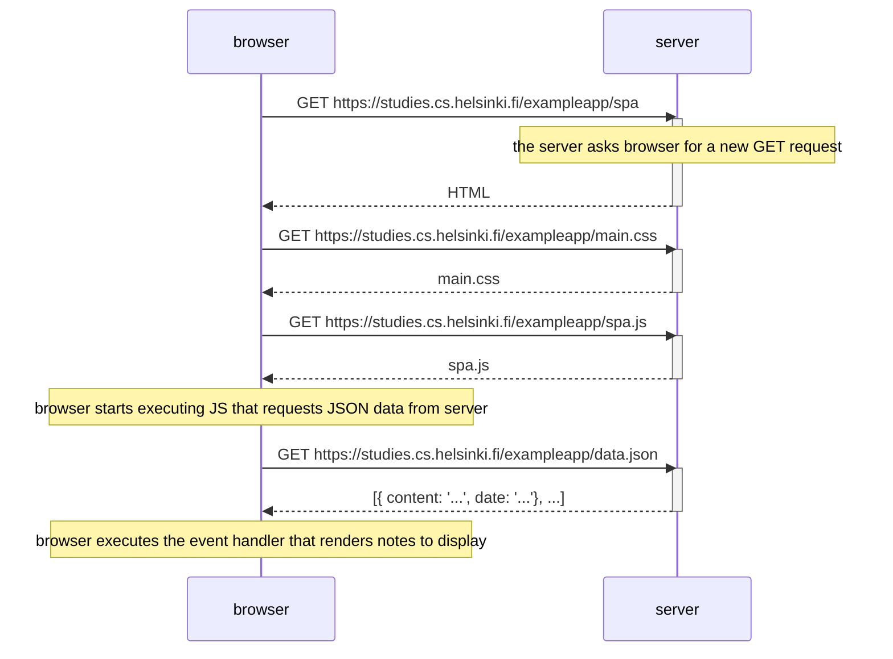

```mermaid
sequenceDiagram
  participant browser
  participant server

  browser->>server: GET https://studies.cs.helsinki.fi/exampleapp/spa
  activate server
  Note over server: the server asks browser for a new GET request
  server-->>browser: HTML
  deactivate server

  browser->>server: GET https://studies.cs.helsinki.fi/exampleapp/main.css
  activate server
  server-->>browser: main.css
  deactivate server

  browser->>server: GET https://studies.cs.helsinki.fi/exampleapp/spa.js
  activate server
  server-->>browser: spa.js
  deactivate server
  Note over browser: browser starts executing JS that requests JSON data from server

  browser->>server: GET https://studies.cs.helsinki.fi/exampleapp/data.json
  activate server
  server-->>browser: [{ content: '...', date: '...'}, ...]
  deactivate server
  Note over browser: browser executes the event handler that renders notes to display

```
