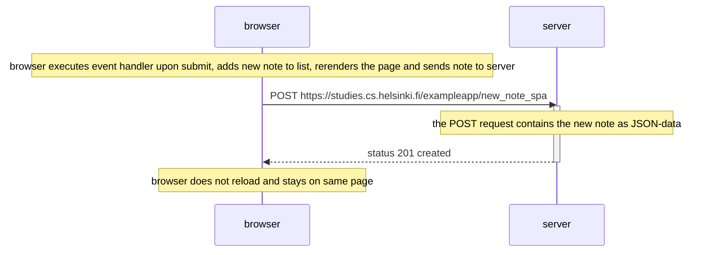

```mermaid
sequenceDiagram
  participant browser
  participant server

  Note over browser: browser executes event handler upon submit, adds new note to list, rerenders the page and sends note to server
  browser->>server: POST https://studies.cs.helsinki.fi/exampleapp/new_note_spa
  activate server
  Note over server: the POST request contains the new note as JSON-data
  server-->>browser: status 201 created
  deactivate server
  Note over browser: browser does not reload and stays on same page

```
